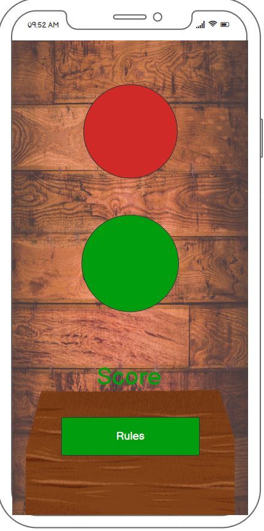
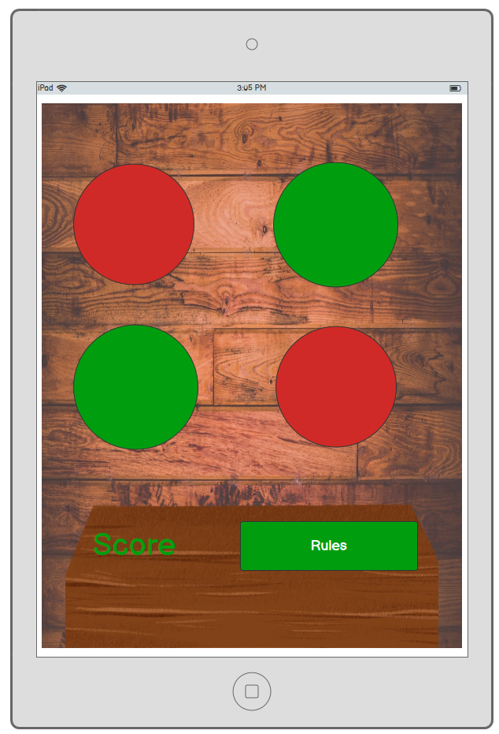
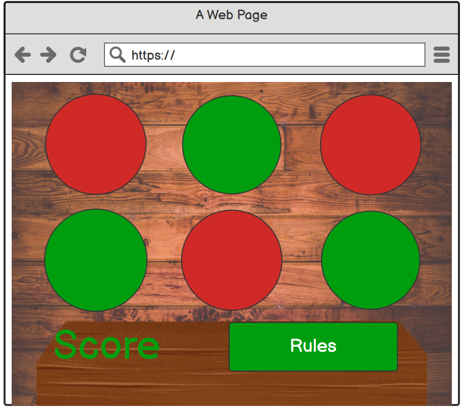

# PP2 - Reaction Lights by Cheryl Phillips 

## Concept
Reaction Lights is a JavaScript game to test reaction speed. The user must react to on screen colour changes, however, any incorrect clicks will loose points. Score 10 points to win the game. 

## User Stories
Visitors to the site must be able to :
* Load the game on their device
* Find out how to play the game
* See their score tally
* Start a new game

## Features of the site
* Rules to display on a separate page, easily accessed from the main page
* Score to be displayed clearly at all times
* Game mode to change depending on the device the game is being played on
* Option to start a new game once the user has scored 10 points

## Wireframes

### Mobile View

The mobile game will be a streamlined 2 button game with score and rules stacked underneath. All elements will be in 1 column on screen to most effective use of space and to prevent any scrolling while the game is in play.

### Tablet View

The tablet game will have a slightly larger 4 button setup to increase the use of a larger space and make the game more of a challenge whilst still ensuring there is no need to scroll and ruin game play. 

### Desktop View

The desktop game will be the most advanced version with a 3 x 3 button grid, maximising the use of space and layout to provide the best gaming experience for the space available. 

## Project Development

### Game Canvas

The mobile game has a slimmer background image, with a vertical single column CSS grid system displaying only stacked 2 buttons. For this a media query has been used to hide the remainder of the buttons on screens 600px and smaller. The mobile game is the standard display and is the base game developed with the larger verions developed from this initial 2 button version. 

The tablet game is designed on a larger 2 column CSS grid, displaying 4 buttons. This is achieved by changing the grid for a media query when the screen width is a minimum of 600px. 

The full desktop game features a 3 column CSS grid and 9 buttons. This view appears for screen sizes over 992px. 

### Timer Function

The timer function in the game is used to randomise how long is it between each state change for the lights. This is achieved by using `Math.random()`, and multiplying this by 2000 to get a time up to 2 seconds. There was no need to turn this into a whole number as it does not matter for the game play. 
## Technologies Used

* HTML
* CSS
* JavaScript
* GitHub
* Chrome DevTools
* Canva
* Paint.NET
## Testing

## Deployment

## Credits

* The `setTimeout()` code for timing of switching lights on and off was used from [Stack Overflow](https://stackoverflow.com/questions/17883692/how-to-set-time-delay-in-javascript).

