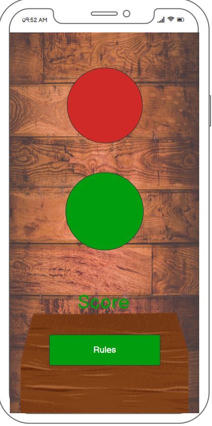
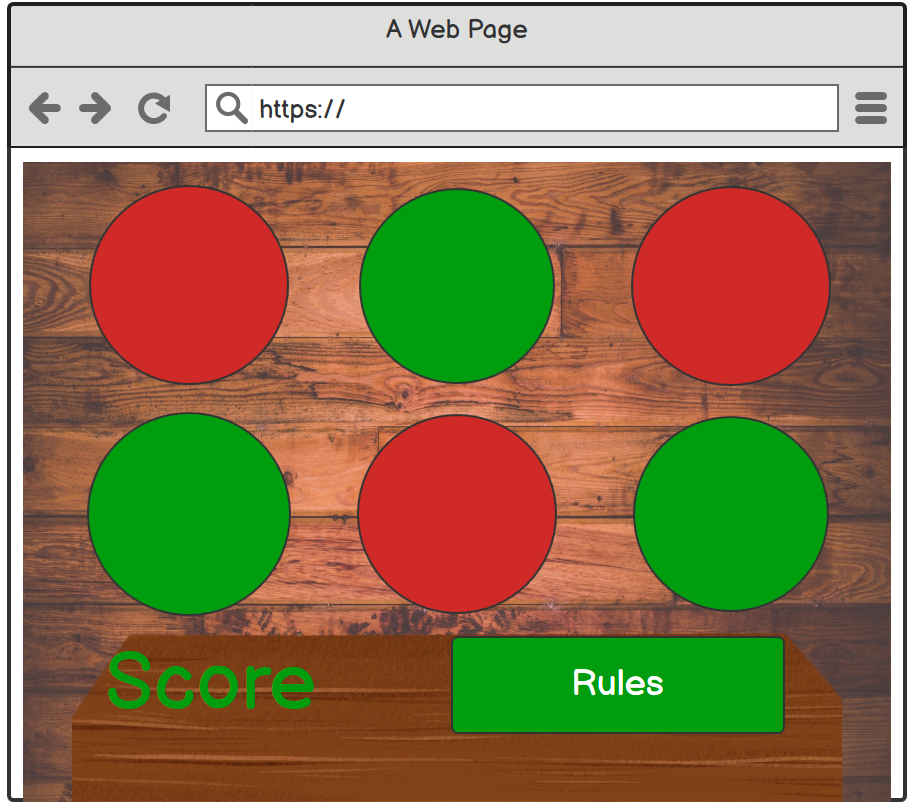

# PP2 - Reaction Lights by Cheryl Phillips 

## Concept
Reaction Lights is a JavaScript game to test reaction speed. The user must react to on screen colour changes, however, any incorrect clicks will loose points. Score 10 points to win the game. 

## User Stories
Visitors to the site must be able to :
* Load the game on their device
* Find out how to play the game
* See their score tally
* Start a new game

## Features of the site
* Rules to display on a separate page, easily accessed from the main page
* Score to be displayed clearly at all times
* Game mode to change depending on the device the game is being played on
* Option to start a new game once the user has scored 10 points

## Wireframes

### Mobile View

The mobile game will be a streamlined 2 button game with score and rules stacked underneath. All elements will be in 1 column on screen to most effective use of space and to prevent any scrolling while the game is in play.

### Tablet View

The tablet game will have a slightly larger 4 button setup to increase the use of a larger space and make the game more of a challenge whilst still ensuring there is no need to scroll and ruin game play. 

### Desktop View

The desktop game will be the most advanced version with a 3 x 3 button grid, maximising the use of space and layout to provide the best gaming experience for the space available. 

## Project Development

## Technologies Used

## Testing

## Deployment

## Credits

