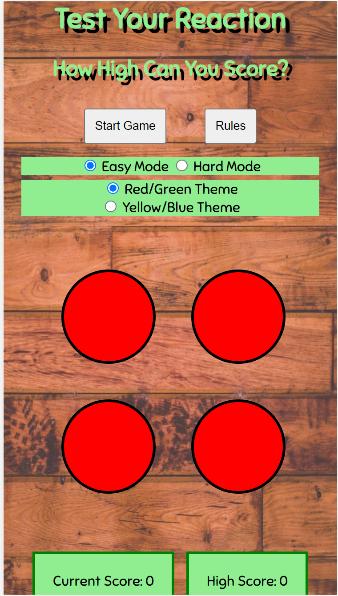

# PP2 - Reaction Lights by Cheryl Phillips 

## Concept
Reaction Lights is a JavaScript game to test reaction speed. The user must react to on screen colour changes, however, any incorrect clicks will end your winning streak. How high can you get your score count before you hit a red light?


## User Stories
Visitors to the site must be able to :
* Load the game on their device
* Find out how to play the game
* See their score tally
* Start a new game

## Features of the site
* Rules are easily accessed from the main page
* Score to be displayed clearly at all times
* Game mode to change depending on the device the game is being played on

## Wireframes

### Mobile View


The mobile game will be a streamlined 2 button game with score and rules stacked underneath. All elements will be in 1 column on screen to most effective use of space and to prevent any scrolling while the game is in play.

### Tablet View


The tablet game will have a slightly larger 4 button setup to increase the use of a larger space and make the game more of a challenge whilst still ensuring there is no need to scroll and ruin game play. 

### Desktop View


The desktop game will be the most advanced version with a 3 x 3 button grid, maximising the use of space and layout to provide the best gaming experience for the space available. 

## Project Development

### Game Canvas

The mobile game has a slimmer background image, with a 2 column CSS grid layout to allow for the screen width limitations and a total of 4 lights on screen. For this a media query has been used to hide the remainder of the lights on screens 600px and smaller. The mobile game is the standard display and is the base game developed with the larger verions developed from this initial 4 button version. 



The tablet game is designed on a larger 2 column CSS grid layout, this time utilising the larger viewing height for a total of 8 lights. This is achieved by changing the grid for a media query when the screen width is a minimum of 600px. 


The full desktop game features a 3 column CSS grid and 9 buttons. This view appears for screen sizes over 992px. 


### Starting And Ending The Game

Gameplay is triggered from the startgame button. Event listeners are attached to the start button and all of the light instances. 
The start button triggers the `resetScore()` function to be run first to ensure the score is reset to zero, it also sets the `endGame` flag to false to tell the `lightOn()` function that it should run when called. The `lightOn()` function is the final thing that is called when the game is started, this starts game play.
Event listeners added to the light instances on loading look for clicks on green/yellow lights and increment the score in this scenario. If the case of a red/blue light being clicked occurs, the `endGame` flag is set to true to stop game play, the `highestScore()` function is called to check and display the highest score for this session of game play on screen next to the current score for the round, and then the `alertModal()` function is called to display a message letting the user know they hit a light in the off state and what their finishing score was. 

### Timer Function

The `lightTimer` function in the game is used to randomise how long is it between each state change for the lights. This is achieved by using `Math.random()`, and multiplying this by 3000 for easy mode or 2000 for hard mode to get a time up to 3 or 2 seconds. There was no need to turn this into a whole number as it does not matter for the game play. 
In order to not have a 0 seconds delay between on and off states. Code is used to check if the random number produced is less than 1000 for easy mode or 500 for hard mode which is 500ms or half a second / 1000ms or 1 second. In either case, a value less than the minimum for the game mode will return the minimum output of either 1000 or 500.
First of all the game mode selector must be checked `let gameMode = document.querySelector('input[name="game_mode"]:checked').value` the output being either easy or hard and this is used to determine which timer values are used:
```js
  if (gameMode == "easy") {
    timer = Math.random() * 3000;
    if (timer <= 1000) {
     timer = 1000;
    }
    return timer;
  } else if (gameMode == "hard") {
    timer = Math.random() * 2000;
    if (timer <= 500) {
     timer = 500;
    }
    return timer;
```
A catch is included at the end of the if statement incase of no game mode being set:
```js
  } else {
    window.alert("Error, Game mode not set");
  }
```

### Light On Function (Main game play)

Main game play is achieved by the `lightOn` function. This function first of all selects a random number from the lights node list which is called from the DOM and stored in the variable `lights`. It does this by using `Math.random` and multiplying that by `lights.length`. This time as the light needs to be an integer, `Math.floor` is also used. Next the random light div that has been selected is assigned to the variable `activeLight`, and the class `light_on` is added to turn it green. 

After an amount of time determined by the function `lightTimer`, `lightOff` is called to remove the `light_on` class and return the light to red again. I used `setTimeOut` code from [Stack Overflow](https://stackoverflow.com/questions/17883692/how-to-set-time-delay-in-javascript) to implement the delay between turning the light on and off.

### Light off function

The function to retun the light to red simply calls `activeLight.classList.remove('light_on');` and then once the game has been reset, calls the `lightOn` function to pick the next light to become active thus creating a game loop. 

### Increment score function

`addScore` is triggered based on the `if` statement in the main game loading sequence. When a player hits a light whilst in the on state, `addScore` fetches the current number stored in the HTML element with the ID of score and increments it by 1, before writing it back to the inner HTML of that same element to display the updated score tally to the player on screen. 

### Reset score function

`resetScore` is triggered either when the player starts a new game. The function fetches the current number stored in the HTML elements with the ID of score and over writes it with 0 before writing the new value back to the DOM.

### Rules Button

The rules for the game are designed as a modal popup. I used code from W3 schools to implement this feature, making changes to the styling to match the overall theme of the game. The original tutorial for this feature can be found [here](https://www.w3schools.com/howto/howto_css_modals.asp). This code used older `var` and `onClick` code, and so I have updated these instances with `let` and `addEventListener` code to ensure the coding is up to date and future proof. 

### Start Button

The game is not active upon loading the webpage, the user triggers this by selecting the start game button at the bottom of the page. There is an event listener attached to the start button that calls the `lightOn()` function to start the game loop running. This allows the player some element of control over the game and gives a similar feel to not having music and sound instantly playing at you when you load a webpage, the lights of the game do not instantly start flashing upon loading the page for the first time for a better user experience.

### Highest Score Function

The highest score function fetches the values stored in the HTML elements with ID of score (the current score) and high_score. Compares the two. And if the current score is higher than the stored highest score, over writes the stored highest score. `parseInt()` was needed to convert the HTML elements into numbers before running the if statement as both values are returned as strings when fetching from the DOM initially. When running the if statement on the values as strings, 10 is returned as a lower value than 9. 

### Root Variables for Colour Changes

Due to the main colours of the game not being suitable for red/green colour blindness, I included the option for users to switch the theme to yellow/blue which are more suitable. This is achieved by setting the colours as root variables rather than the rgb values in the css file. 
An event listener on the radio buttons triggers the change when a user clicks to switch between colour schemes. 

### Game end modal function

When a red or blue light is hit, a modal box appears informing the player that they hit a red/blue light and what their final score was for that round. I used the base code from the W3 Schools tutorial to build the modal popup, and modified it to be called by a function rather than activated by a button click. The styling elements have been re used to avoid duplicating code in the stylesheet, and to ensure a continuation of the game theme. 

## Technologies Used

* HTML - Main language used for base site design.
* CSS - Main language used for over all site styling.
* JavaScript - Main language used for game interactive functionality.
* [GitHub](https://github.com/) - Used for version control during project development and cloud hosting of project code.
* Git - Version control technology behind Github.
* CSS Grid - Functionality used to allow responsive layout design. 
* CSS Root variables - Used for colour switching functionality of the game.
* [Github Projects](https://github.com/users/ccp84/projects/1/views/1) - Used to track completion of project components.
* [Github Issues](https://github.com/ccp84/reaction_lights/issues?q=is%3Aissue+is%3Aclosed) - Used to track code errors and progress on bug fixes.
* Chrome DevTools - Used for under construction checking of code output and console logs. 
* [Canva](https://www.canva.com/) - Background image design.
* Paint.NET - Image manipulation and resizing.
* [Google Fonts](https://fonts.google.com/).
## Testing

[Link to testing carried out](TESTING.md)

## Deployment

The site was deployed to GitHub pages. The steps to deploy are as follows: 
  - In the [GitHub repository](https://github.com/ccp84/reaction_lights), navigate to the Settings tab 
  - From the source section drop-down menu, select the **Main** Branch, then click "Save".
  - The page will be automatically refreshed with a detailed ribbon display to indicate the successful deployment.

The live link can be found [here](https://ccp84.github.io/reaction_lights)

### Local Deployment

In order to make a local copy of this project, you can clone it. In your IDE Terminal, type the following command to clone my repository:

- `git clone https://github.com/ccp84/reaction_lights.git`

Alternatively, if using Gitpod, you can click below to create your own workspace using this repository.

[](https://gitpod.io/#https://github.com/ccp84/reaction_lights)

## Credits

* The `setTimeout()` code for timing of switching lights on and off was used from [Stack Overflow](https://stackoverflow.com/questions/17883692/how-to-set-time-delay-in-javascript).
* The modal box popup for the rules is taken from [W3Schools](https://www.w3schools.com/howto/howto_css_modals.asp).
* Sniglet font used from [Google Fonts](https://fonts.google.com/specimen/Sniglet).
* Code for getting the currently checked radio button used from [Stack Overflow](https://stackoverflow.com/questions/9618504/how-to-get-the-selected-radio-button-s-value).
* Tutorial for using root variables in CSS followed from [W3 Schools](https://www.w3schools.com/css/css3_variables.asp).
* Background image design from [Canva](https://www.canva.com/design/DAFMBfJP2s4/yP-TxylKcBElJeP74IlmMg/edit).