# Testing Documentation for Reaction Lights

## User Stories and Features

|Visitors to the site should be able to: |     |     |
|--------------------------------------- |-----|-----|
|Load the game on their device | The game has been tested to load on varying screen sizes | 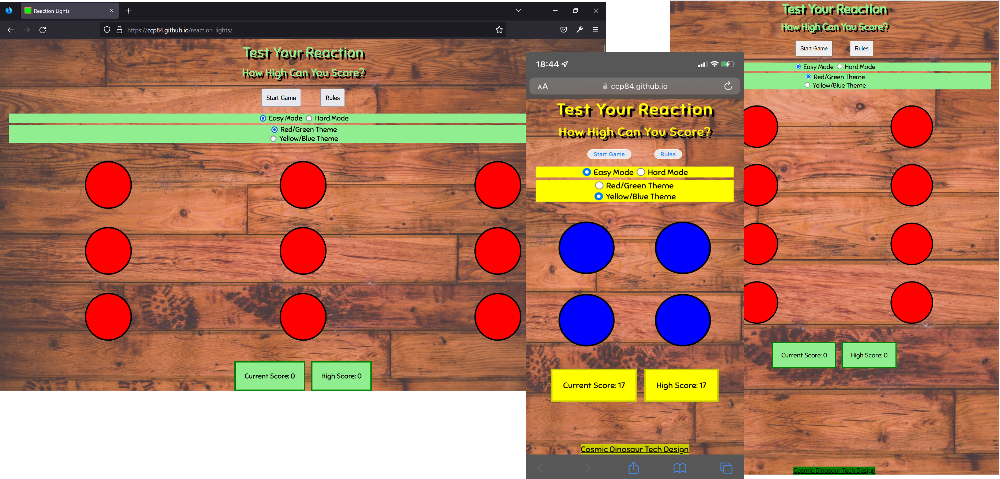|
|Find out how to play the game | The rules can be displayed from the button at the top of the main page | 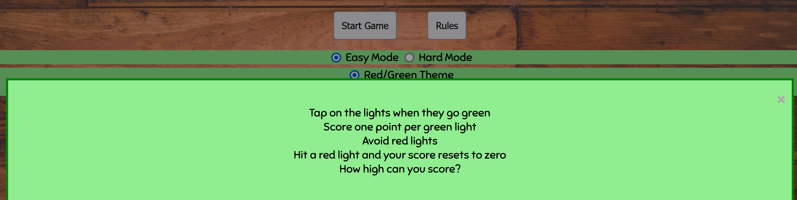|
|See their score tally | Both the current game score, and highest score, are displayed at the bottom of the screen | 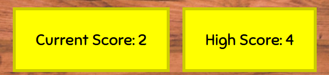|
|Start a new game | The start game button is easily visible at the top of the game screen | 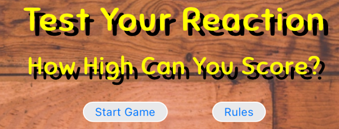|

|Features of the site: |    |    |
|----------------------|----|----|
|Rules are easily accessed from the main page | The rules can be displayed from the button at the top of the page | |
|Score to be displayed clearly at all times | Current and highest score is displayed at the bottom of the screen | |
|Game mode to change depending on the device the game is being played on | Media queries allow for differing viewport widths. Either a 4, 8 or 9 light game is displayed. | |

## Project Development Bug Fixes

During project development I have used GitHub Issues to track and monitor bug fixes. Closed issues along with their fixes can be found here https://github.com/ccp84/reaction_lights/issues?q=is%3Aissue+is%3Aclosed

## Code Validation

### W3C Validator

An error was recorded for using a `<ul>` tag within a `` 

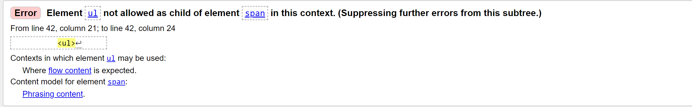

This was cleared by changing the `` to a `
` element.

### Jigsaw Validator

CSS validation was clear on the first time of running. 

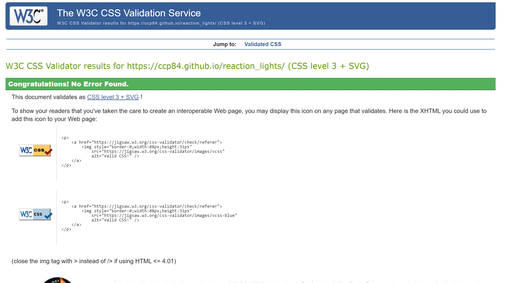

### Jshint Validator

## Responsiveness

Media queries work for the game to allow for the best display on differing viewport widths. As standard, a 2 x 2 CSS grid is diplayed for devices under 600px in width and has been tested as working down to screens 320px in width. A media query changes the grid display to a 4 x 4 display for screens above 600px in width this is tested as working up to 991px width. The final breakpoint is tested as working for screen widths over 992px and produces a grid 3 x 3 in size.

## Accessibility (Lighthouse Score)

Performance score of 94 with nothing that can be improved upon for this area

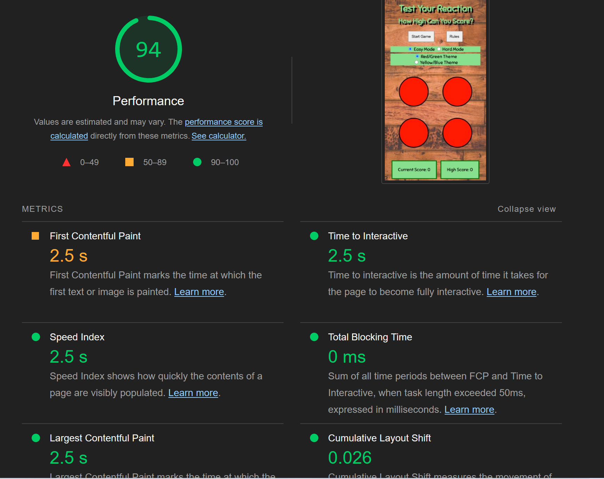

Accessibility score of 96 due to footer text contrast. This can be improved easily.

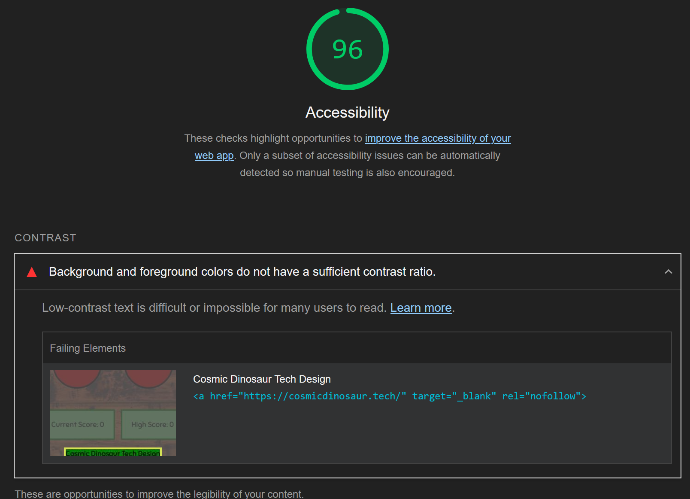

With the styling changed, the accessibility score is now 100.

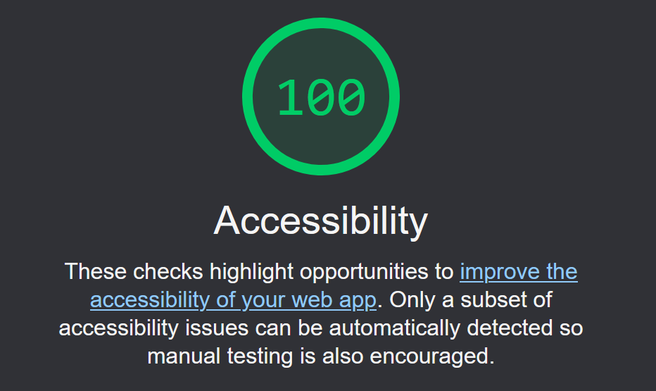

Best practices score is 100

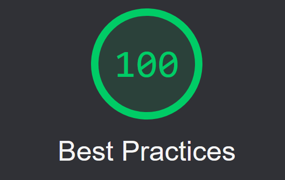

SEO score is 96. This can be improved upon by resizing the radio buttons for colour changes and giving more space around the tap area.

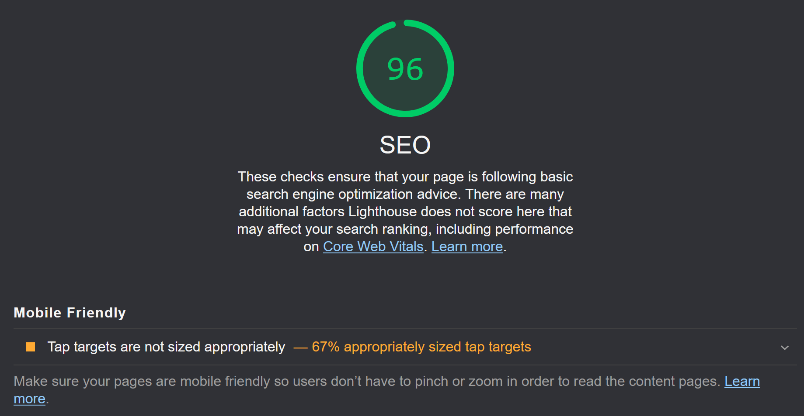

SEO score is now 100 with sizing and spacing changes made.

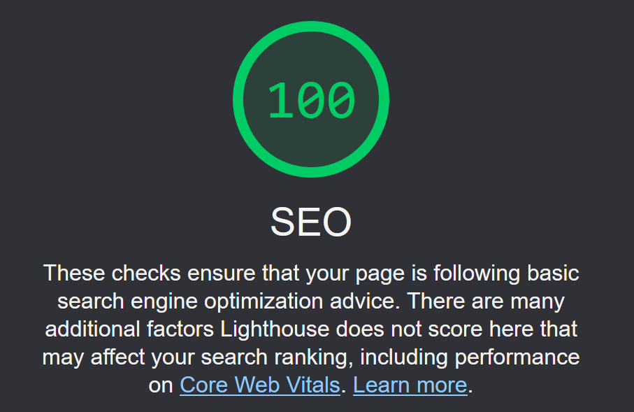

## Browser Compatibility

The game has been tested successfully in:

### Chrome

### Edge

### Firefox Developer

### Safari
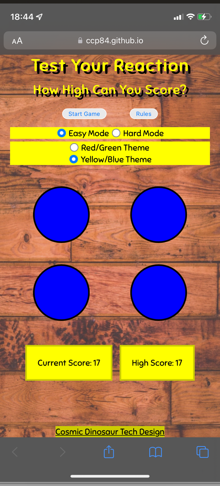

* [Return to Readme](README.md)